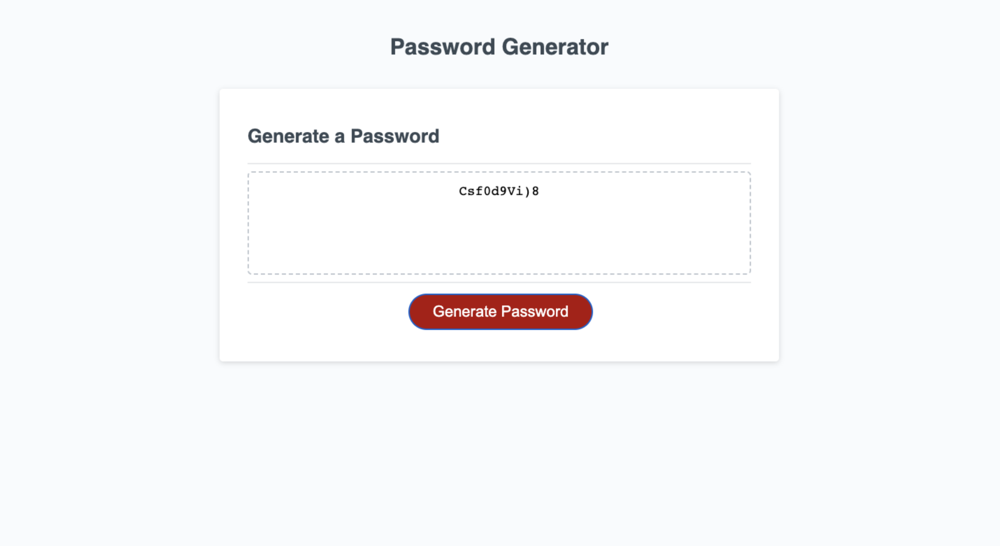

# <CODING BOOTCAMP: CHALLENGE #3>

## Description

The intention of this web development project is to make an application that generates a random password (a string of characters) after taking user preferences from predetermined prompt alerts. The user will answer prompts on desired password length and define what types of characters they want in their password.

My project was deployed to the following website: https://pvlln.github.io/PabloVillalon-challenge-3/

Here you will find my finished project. 

## Installation

To get my project running, you simply need to access the deployed website. The user then must answer a series of questions when prompted. This website works best using Chromium-Based browsers. 

## Usage

To use this site, you only need to answer the prompt alerts that will lead to your password being generated.

## Credits

Credit to myself, 2023.

## License

This website is covered under the MIT copyright license. For more information, google it. 

## Badges

Nope, no badges. 

## Features

My project has two JavaScript functions. You may see them in action in the developer console. 

## How to Contribute

I am not accepting contributions to this site. 

## Tests

In order to test the functionality of the site, you may generate different passwords with different answers to the prompts, and see the results. 
